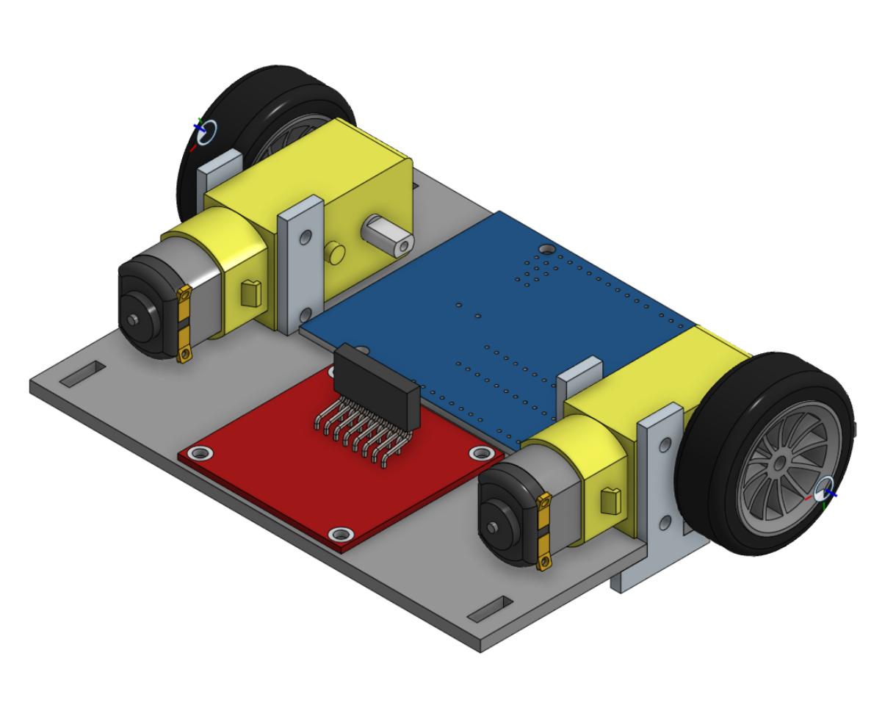
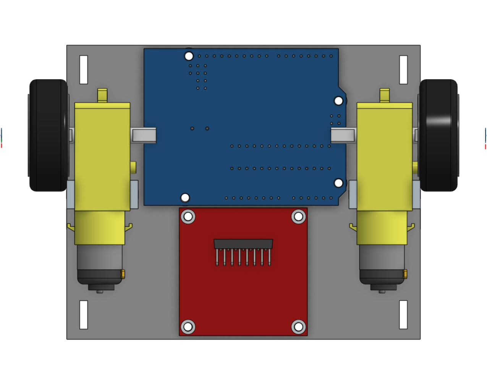
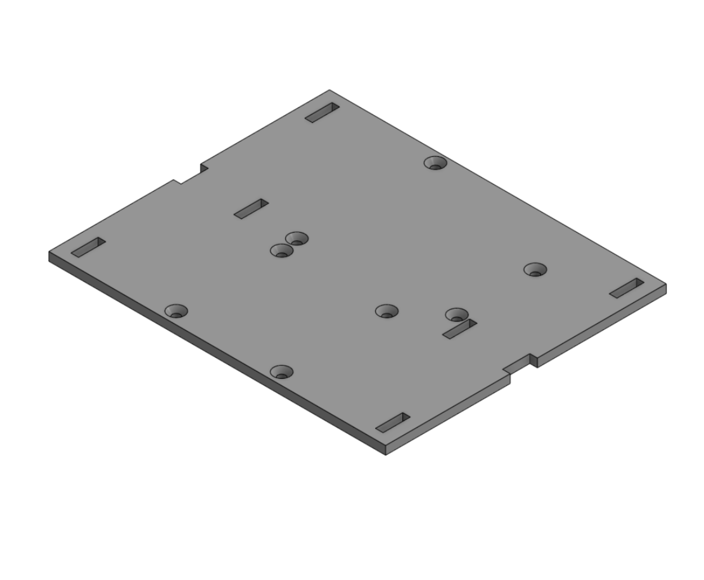
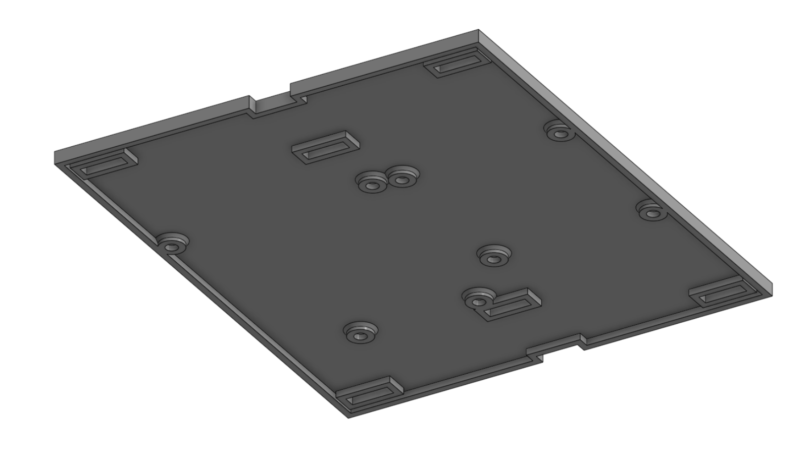
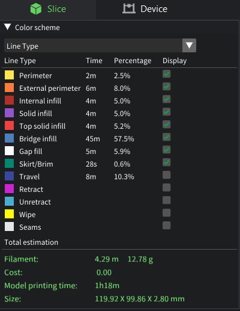

# Robot Base Design

This repository contains the mechanical design of a **two-wheel differential robot base**, modeled in **Onshape** and optimized for **3D printing** with a focus on **weight reduction** and **structural stability**.

---

## Design Features

- **Compact dimensions:**  
  120 × 100 mm base footprint  
- **Lightweight design:**  
  Internal shelling applied to reduce material usage
- **Stable motor mounting:**  
  Motors are aligned to ensure smooth wheel rotation
- **Electronics-ready layout:**  
  Dedicated mounting points for controller and motor driver

---

## Weight Optimization & 3D Printing

The base was prepared for 3D printing using the following considerations:

- **Material:** PLA  
  - Lightweight  
  - Easy to print  
  - Suitable for prototyping
- **Shell (hollowing):** 1.5 mm  
- **Layer height:** 0.1 mm  
- **Wall loops:** 3  
- **Final estimated weight:** **12.78 g** (measured using EufyMake Studio)

---

## Design Preview

### Assembly View

### Top View

### Base Plate (Top)

### Base Plate (Bottom)

### Weight Estimation (EufyMake)

---

## Files Included

- `robot base assembly.stl` — Full robot base assembly
- Images documenting the design and slicing results

---

## Onshape CAD Link

You can view and inspect the full CAD model directly on Onshape using the link below:

👉 [View Robot Base on Onshape](https://cad.onshape.com/documents/1d8c780fe063db733f895494/w/b8b6d437120b54de7aa5b1ef/e/c2163c72fda0a206ef50e7a0?renderMode=0&uiState=697d3819fdd08419d04b2102)

This link allows viewing the complete design, dimensions, and assembly without downloading any files.
